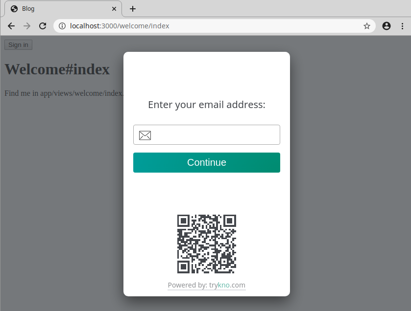

# Kno Ruby

[](https://badge.fury.io/rb/kno)

### Go Passwordless with [trykno.com](https://trykno.com)

Use the Kno service for passwordless authentication, it handles sending emails so you don't have too.
It also allows users to set up device based authentication so they don't have to wait for any email, after the first.

## Installation

Add `kno` as a dependency in your `Gemfile`:

```
gem `kno`
```

Install it using bundler, run:

```
$ bundle install
```

## Usage

This library integrates Kno into any Rack based application, including Rails, Hanami and Sinatra.

- [Rails](#rails-integration)
- [Sinatra](#sinatra-integration)

### Rails integration

<!-- See [MyRailsApp](examples/my_rails_app) -->

#### Configure middleware

Add `Kno::Session` to the middleware stack, by configuring it in `/my_app/config/application.rb`

```ruby
module MyApp
  class Application < Rails::Application
    # ...
    config.load_defaults 6.0

    config.middleware.use Kno::Session, sign_in_redirect: "/"
  end
end
```

_Make sure to add `Kno::Session` after the default middleware as it requires the session middleware to be applied._

#### Add sign in/out button

Use the helpers that Kno added to the request to show the correct sign in, or sign out, button.

```erb
<%= request.env['kno'].session_button().html_safe %>
```

#### Check the user is authenticated

Controllers can check if a users is authenticated by looking up there `persona_id`.

```rb
persona_id = request.env['kno'].persona_id
```

With Kno users are uniquely identified by their `persona_id`.
If the request is unauthenticated then the value will be nil.

#### Local development

Authentication is now setup for local development.
Run locally and click the sign in button and you should see a sign in modal.



Enter your **real** email address. Kno runs a service for local development that sends a limited number of emails.

### Get production keys

To use Kno in production you will need site and API tokens for your application.

Create an account at [trykno.com](https://trykno.com) and follow the guidance to create your first space.
This will direct you to create a `site_token` and `api_token`.
Add these to your environment and edit the middleware configuration.

```ruby
config.middleware.use Kno::Session,
  sign_in_redirect: "/"
  site_token: ENV["KNO_SITE_TOKEN"],
  api_token: ENV["KNO_API_TOKEN"]
```

**NOTE: The tokens do not have to be stored in the environment.
However the api token MUST be kept secure and should not be committed to your applications source code.**

## Contributing

Contributions are very welcome. Please do open an issue or pull request or reach out to us at [team@trykno.com](mailto:team@trykno.com)

#### Docker

If you do not have node installed you can run locally in Docker with the following command.

```bash
docker run \
  -it \
  --rm \
  -w="/opt/app" \
  -v="$(pwd):/opt/app" \
  --env="PORT=3000" \
  -p="3000:3000" \
  --network="host" \
  ruby:2.7.0 bash
```

**NOTE**: You will need to bundle install every time you start a container with this command
